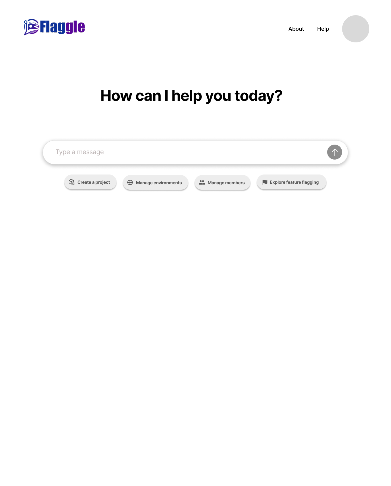
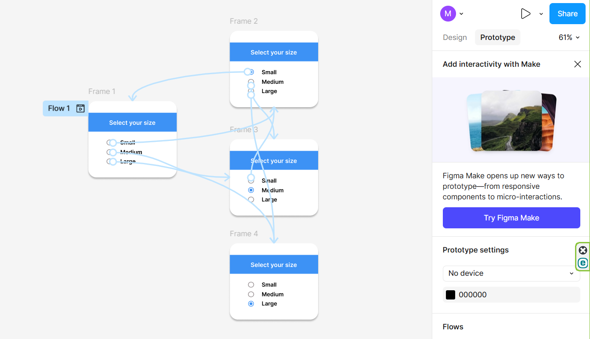

# Figma Design Portfolio

Welcome to my Figma design portfolio.

This repository contains selected examples of my work in interface design, design iteration, interactive prototyping, visual organization, and client tutorial development using Figma.

My work focuses on transforming requirements and information into clear, practical, and visually organized designs.

---

## Featured Projects

### 1. Web Application UI Design

This project contains interface design proposals and final screens created for the Home and About pages of a web application.

Multiple concepts were developed and reviewed before the final layouts were selected and refined.

#### My Contributions

- Created multiple Home and About page design proposals
- Explored different layouts, content arrangements, and visual directions
- Developed page structures and information hierarchy
- Refined designs based on requirements and feedback
- Prepared the final selected interface designs
- Maintained visual consistency across related screens

#### Skills Demonstrated

- User interface design
- Page layout
- Visual hierarchy
- Information organization
- Design iteration
- Requirement interpretation
- Figma design workflow

[View the complete project](./01-web-application-ui-design/)

---

### 2. Client Figma Tutorial Projects

These projects were created as client deliverables to demonstrate specific Figma design and prototyping techniques.

Each tutorial included a completed design, an interactive prototype flow, and a structured visual explanation of the process.

#### Tutorial Topics

- Radio button components and interactions
- Hover-based interface interactions
- Scrollable overlay design and prototyping

#### My Contributions

- Created the Figma design examples
- Configured component and prototype interactions
- Developed structured tutorial flows
- Captured visual examples of the completed designs
- Prepared prototype-flow screenshots
- Organized the tutorial content for clear presentation

#### Skills Demonstrated

- Figma components
- Interactive prototyping
- Component states
- Hover interactions
- Scrollable overlays
- Instructional design
- Screenshot documentation
- Visual communication

[View the complete project](./02-client-figma-tutorials/)

---

## Figma Skills

- User interface design
- Interactive prototyping
- Components and variants
- Radio button interactions
- Hover interactions
- Scrollable overlays
- Page and screen layout
- Visual hierarchy
- Information organization
- Design iteration
- Design proposal development
- Tutorial and instructional design
- Prototype-flow documentation
- Screenshot preparation
- Visual quality review

---

## About Me

I have experience across enterprise technology, application support, quality assurance, data and reporting, technical documentation, and interface design.

My technical background helps me understand application requirements and system workflows, while my design experience allows me to organize complex information into clear and user-friendly interfaces.

My strongest design areas include Figma interface design, visual organization, interactive prototyping, design iteration, instructional content, and quality assurance.

---

## Portfolio Notes

Some materials were originally completed as part of professional or client work.

Where necessary, designs have been sanitized, recreated, or anonymized to remove confidential information, proprietary details, internal identifiers, and client-sensitive content.

All descriptions reflect the work and contributions I personally completed.
